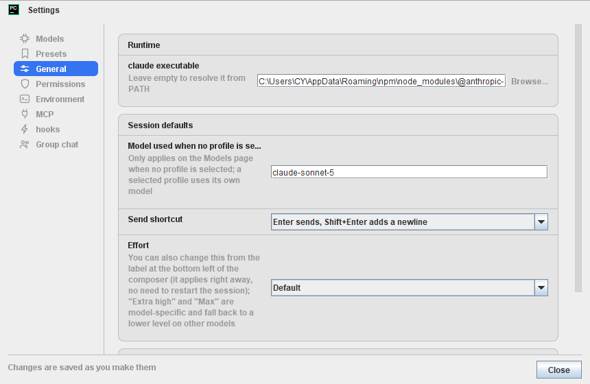
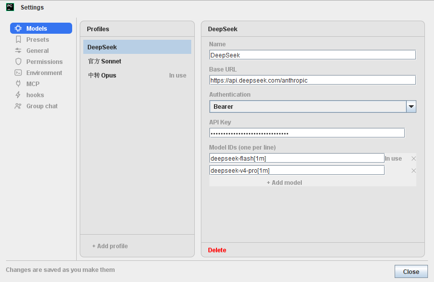
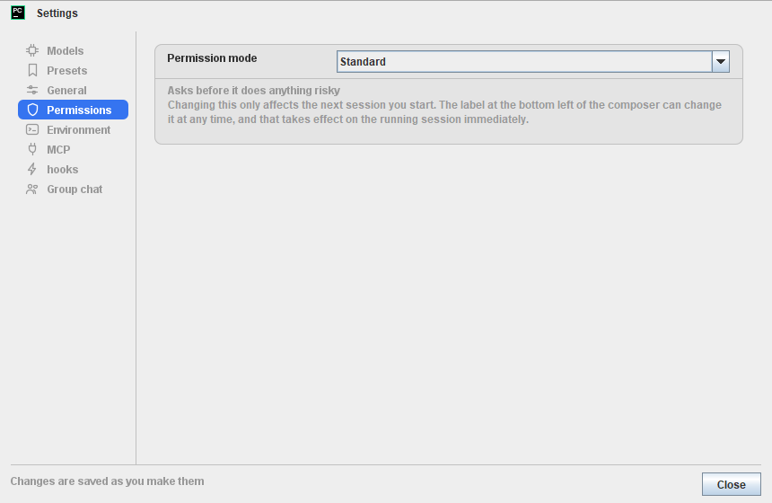

# CCoder

[](https://plugins.jetbrains.com/plugin/34281)
[](https://plugins.jetbrains.com/plugin/34281)
[](LICENSE)

**English** · [简体中文](README.zh-CN.md)

Claude Code in a PyCharm tool window: chat against the project you are editing, see every
file edit as a diff before it lands, and approve the commands that touch your machine.



CCoder drives the Claude Code CLI (`claude`) you already have installed — it is not another
AI backend and ships no key of its own. It works on the project you have open: its files,
its `CLAUDE.md`, its settings. Sessions are the CLI's own files under `~/.claude/projects/`,
so what you do here is the same work `claude` sees from a terminal.

## Install

- **Marketplace** — [CCoder on JetBrains Marketplace](https://plugins.jetbrains.com/plugin/34281) → *Install to PyCharm*.
- **From a ZIP** — Settings → Plugins → ⚙ → *Install Plugin from Disk*, then restart the IDE.
  Get the ZIP by [building it yourself](#development) (`./gradlew buildPlugin`).

## Requirements

- **PyCharm 2025.3** or newer (build 253+). No upper bound — the plugin stays installable on
  future IDEs.
- **Claude Code CLI (`claude`)** — **not bundled**; CCoder drives the copy you installed.
  Don't have it? Settings → Environment → *Runtime dependencies* detects it and can run the
  install for you (it shows the command first).
- **Node.js 18+** — the sidecar runs on it. Installing the CLI with npm needs Node 22+, and
  the plugin checks that before offering the button.
- Whatever the CLI itself needs to talk to Anthropic: a subscription, an account, or an API key.

## What it does

### Working in the project

- `@` references files and the code you selected in the editor (both show as one-line tokens
  and expand when sent); `#` references project symbols such as classes and functions.
  Completion is fuzzy — `cmprk` finds `ComposerMode.kt`.
- `/` opens slash commands and the preset prompts you saved.
- Ctrl+V pastes a screenshot straight into the input box — up to 4 per message. Click a
  thumbnail to open it full size.
- Type while Claude is working and your message is queued, sent when the turn ends.
- The empty input box spells out the three triggers: `@ files · # symbols · / commands`.

### Changes you can see — and stop

- Every file edit is shown as a diff before it is applied.
- Commands that touch your machine (shell, writes outside the project) wait for your Allow or
  Deny. A pending request also shows in the status bar, so it is not lost if you switch away.
- Six permission modes — **Standard**, **Accept edits**, **Auto**, **Plan only**,
  **Don't ask**, **Bypass permissions**. The mode and the thinking effort can also be changed
  from the labels at the bottom of the input box, without reopening the session.
- Plan approvals are laid out as Markdown (tables included), in dialogs you can resize.
- Running subagents and background commands can be stopped one by one — the Agents popup
  lists them under *Running*, each row with a small ■ at its right edge. Only that task stops;
  the conversation goes on.

### Sessions

- Up to five at once in one window; each has its own chip with a status dot — running /
  waiting on you / idle.
- Named after your first message; resume, rename or delete from the list. Closing a tab that
  is still working asks first.
- Reopening an old session replays it from the CLI's own records, nested subagent steps and
  all.
- On an idle session, the Link card offers **Clear session** (start fresh — the old one stays
  on disk) and the Context card offers **Compact context** (summarize to free up room).

### Bring your own model

- Pick the model and the thinking effort; model profiles point at your own gateway or
  endpoint (Base URL + key — any OpenAI-compatible endpoint works).
- A profile can carry its own environment variables for the CLI.

### Project configuration

- **MCP** — read and edit the project's `.mcp.json`, with the live connection status of every
  server.
- **Hooks** — read and edit hooks in the project's `.claude/settings.json`; nothing else in
  that file is touched.

### Interface language

Follow the IDE, Chinese, or English (Settings → General). Switching takes effect right away —
no IDE restart, no session to reopen. Claude's replies follow your prompt's language.

## The window at a glance

- The transcript fills the tool window; the input box sits at the bottom, with the model, the
  permission mode and the thinking effort on its bottom row.
- Four status cards sit above the input box — **Link**, **Context**, **Tasks**, **Agents**.
  Click one for a detail popup: the context breakdown, the todo list, or the running and
  finished subagents (click one to read its transcript).
- The gear at the top right opens Settings.

## Settings

Everything is in the gear at the top right of the tool window, and changes save as you make
them.

| Page | What is there |
|---|---|
| **Models** | Model profiles: name, auth kind, Base URL, model ids, key |
| **Presets** | Your own prompt presets (`/` in the input box) |
| **General** | Runtime (the `claude` executable), session defaults (fallback model, effort, send shortcut), interface language |
| **Permissions** | The permission mode new sessions start in |
| **Environment** | Runtime dependencies (detect / install `claude` and Node), extra directories (`--add-dir`), environment variables |
| **MCP** | The project's `.mcp.json` + the live status of each server |
| **Hooks** | Hooks in the project's `.claude/settings.json` |
| **Group chat** | The author's WeChat QR code, for questions and feedback |





## Troubleshooting

- **"node not found" / "version too old"** — CCoder needs Node 18+. Settings → Environment →
  Runtime dependencies checks it and can install or upgrade it. Installed Node *after* the IDE
  started? Restart the IDE — the process PATH is inherited at startup.
- **"claude not found"** — the same page detects and installs it, or type the full path into
  Settings → General → *claude executable*. A common Windows cause: npm's global prefix was
  moved, so `claude` is not on `PATH` (`npm prefix -g` tells you where it went).
- **401 Invalid token, or requests go somewhere you did not configure** — the CLI also reads
  `~/.claude/settings.json`, and its `env` block wins over the environment a profile sets.
  Check that file for `ANTHROPIC_AUTH_TOKEN` / `ANTHROPIC_BASE_URL`.
- **Bypass permissions cannot be selected** — it is disabled by policy or by
  `permissions.disableBypassPermissionsMode` in `~/.claude/settings.json`; CCoder tells you
  which one.
- **A mid-session permission-mode change did not apply** — some switches need a newer `claude`
  executable; the popup says so, and the change applies from the next session.
- **The CLI was installed by CCoder but a session still cannot find it** — restart the IDE
  (see the PATH note above).

## How it works

Three layers:

```
Kotlin (Swing UI, IDE side)  →  Node sidecar (NDJSON over stdio)  →  claude CLI
                                        ↑
                          transcript rendered by a React app in JCEF
```

- The plugin never talks to Anthropic itself; it launches the CLI and talks to that. Your code
  and prompts go wherever the CLI is configured to send them.
- Settings live in the IDE's plugin config (`ccoder.xml`). Project-level configuration is
  written where the CLI reads it: `.mcp.json` and `.claude/settings.json`.

## Development

```bash
./gradlew runIde            # a sandbox IDE with the plugin installed
./gradlew test              # Kotlin tests (also builds the transcript UI)
./gradlew test -PskipWeb    # Kotlin only — faster when you did not touch web/
cd sidecar && npm test      # sidecar — node --test
cd web && npm test          # transcript UI — vitest
./gradlew buildPlugin       # → build/distributions/CCoder-<version>.zip (Node must be on PATH)
./gradlew verifyPlugin      # JetBrains' checks against the supported IDEs
```

`./gradlew buildPlugin` shells out to `npm` for the transcript UI, so Node must be on the
daemon's `PATH` — run `./gradlew --stop` first if you just installed it.

Design docs, specs and the reasoning behind most decisions are in
[`docs/superpowers/`](docs/superpowers/).

## License and third-party components

MIT — see [LICENSE](LICENSE). That covers this project's own code.

The plugin bundle includes
[`@anthropic-ai/claude-agent-sdk`](https://www.npmjs.com/package/@anthropic-ai/claude-agent-sdk).
It is Anthropic's own software and remains under **its** terms — "© Anthropic PBC. All rights
reserved."

Not affiliated with Anthropic. "Claude" and "Claude Code" are trademarks of Anthropic PBC.
