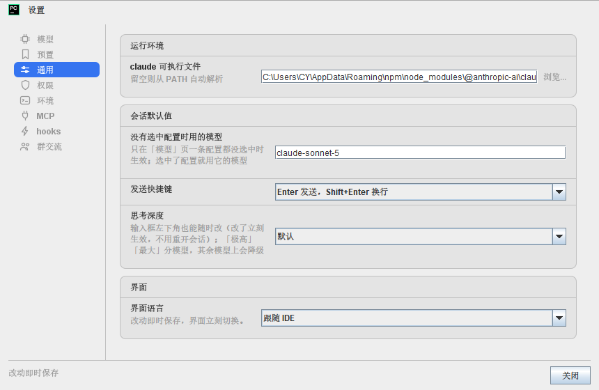
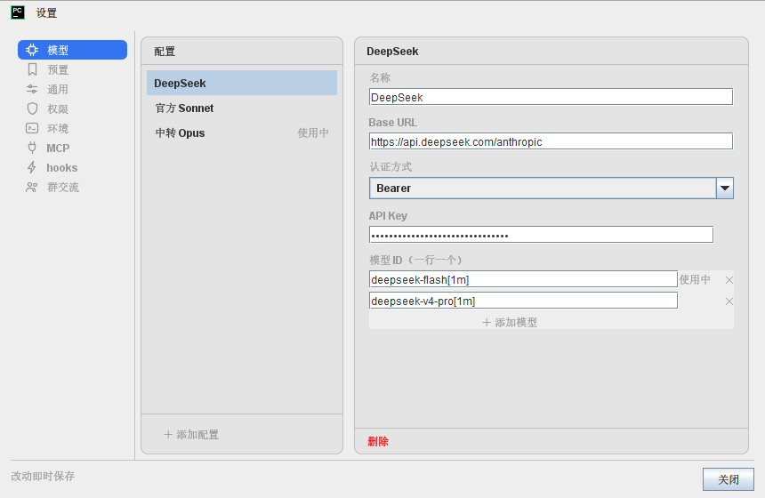
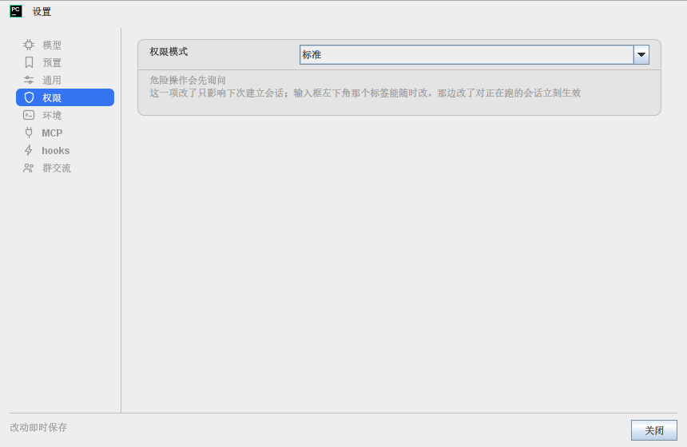

# CCoder

[](https://plugins.jetbrains.com/plugin/34281)
[](https://plugins.jetbrains.com/plugin/34281)
[](LICENSE)

[English](README.md) · **简体中文**

在 PyCharm 的工具窗口里跑 Claude Code：就着你正在编辑的项目提问，每次改文件都先给你看
diff，会动你机器的命令由你放行或拒绝。



CCoder 驱动的是你自己已经装好的 Claude Code CLI（`claude`）—— 它不是另一个 AI 后端，
也不自带任何密钥。它就在你打开的那个项目里干活：项目里的文件、它的 `CLAUDE.md`、它的设置。
会话文件是 CLI 自己的（`~/.claude/projects/` 下），所以这里做的事和你在终端里跑 `claude`
看到的是同一份。

## 安装

- **市场** —— [CCoder on JetBrains Marketplace](https://plugins.jetbrains.com/plugin/34281) →
  *Install to PyCharm*。
- **本地 ZIP** —— 从 [Releases](https://github.com/princeyuaner/CCoder/releases) 下
  `CCoder-<版本>.zip`（也可以[自己打](#开发)），然后 设置 → 插件 → ⚙ → *从磁盘安装插件*。

## 需要什么

- **PyCharm 2025.3** 或更新版本（build 253+）。没写上限 —— 将来的 IDE 版本也装得上。
- **Claude Code CLI（`claude`）** —— **不随插件分发**，驱动的是你已经装好的那份。
  还没装？设置 → 环境 → *运行依赖* 能检测出来并替你装（装之前先把命令给你看）。
- **Node.js 18+** —— sidecar 跑在它上面。用 npm 装 CLI 需要 Node 22+，插件会在给按钮之前先查这一条。
- CLI 本身要的东西：Anthropic 账号 / 订阅 / API key。

## 它能做什么

### 在这个项目里干活

- `@` 引用文件，以及在编辑器里选中的代码（都显示成一行记号，发送时才展开）；`#` 引用项目里的
  类、函数等符号。补全是模糊的 —— 敲 `cmprk` 也能找到 `ComposerMode.kt`。
- `/` 打开斜杠命令，以及你在设置里存下的预置 prompt。
- Ctrl+V 把截图贴进输入框，一条消息最多 4 张；点缩略图能看大图。
- Claude 干活时你照样能打字：消息排进队列，当前这轮一结束就发出去。
- 空着的输入框自己写着这三条：`@ 文件 · # 符号 · / 命令`。

### 看得到、也拦得住的改动

- 每次改文件都先给你看 diff。
- 会动你机器的命令（shell、项目外的写入）由你放行或拒绝。待确认的请求还会在状态栏常驻显示 ——
  切走了也不会漏掉。
- 六种权限模式：**标准**、**自动接受编辑**、**自动判定**、**仅规划**、**不询问**、**绕过权限**。
  权限模式和思考档位在输入框左下角也能随时改，不用重开会话。
- 计划审批按 Markdown 排版（表格也是表格），框可以拉伸。
- 在跑的子代理与后台命令可以逐个终止 —— 「子代理」浮层里 *运行中* 那段，每行右端有一颗小 ■。
  停的只是那一个任务，聊天继续。

### 会话

- 一个窗口里最多同时开 5 条会话；每条一颗胶囊，一颗状态点在跑 / 等你 / 空闲。
- 会话名取你说的第一句；列表里可恢复、改名、删除。关掉还在干活的标签会先问一句。
- 恢复旧会话是照 CLI 自己的记录回放的 —— 子代理那一层层嵌套的步骤也在。
- 会话空闲时，「连接」卡上有一颗**清空会话**（开一条新的，旧的留在磁盘上），「上下文」卡上有一颗
  **压缩上下文**（让 CLI 压缩成摘要，腾出空间）。

### 自带模型

- 选模型与思考档位；模型配置（profile）还能指向你自己的网关或端点（Base URL + 密钥，
  OpenAI 兼容的端点即可）。
- 一条配置可以带它自己的一套环境变量给 CLI 用。

### 项目配置

- **MCP** —— 读写项目级 `.mcp.json`，每个 server 的连接状态实时可见。
- **hooks** —— 读写项目级 `.claude/settings.json` 里的 hooks；同文件别的内容一个字节不动。

### 界面语言

跟随 IDE、中文、English（设置 → 通用）。改完立刻生效 —— 不用重启 IDE，也不用重开会话。
Claude 的回复跟着你提问的语言走。

## 窗口里都有什么

- 中间是转写区，底部是输入框；输入框最下面一行写着当前的模型、权限模式与思考档位。
- 输入框上面四张状态卡 —— **连接**、**上下文**、**任务列表**、**子代理**。点一张看细节浮层：
  上下文的用量明细、待办清单，或者正在跑与跑过的子代理（点一条能看它的转写）。
- 右上角那个齿轮就是设置。

## 设置

全部在工具窗口右上角的齿轮里，改动即时保存。

| 页 | 里面是什么 |
|---|---|
| **模型** | 模型配置：名称、认证方式、Base URL、模型 ID、密钥 |
| **预置** | 你自己的 prompt 预置（输入框里打 `/` 就能选） |
| **通用** | 运行环境（`claude` 可执行文件）、会话默认值（没有选中配置时用的模型、思考深度、发送快捷键）、界面语言 |
| **权限** | 新会话默认用哪种权限模式 |
| **环境** | 运行依赖（检测 / 安装 `claude` 与 Node）、额外目录（`--add-dir`）、环境变量 |
| **MCP** | 项目级 `.mcp.json` + 每个 server 的实时状态 |
| **hooks** | 项目级 `.claude/settings.json` 里的 hooks |
| **群交流** | 作者的微信二维码，有问题扫码找我 |





## 出问题时先看这几条

- **提示找不到 node / 版本过低** —— CCoder 需要 Node 18+。设置 → 环境 → *运行依赖* 能检测并
  安装或升级。如果是**在 IDE 启动之后**才装的 Node，重启 IDE —— 进程的 PATH 是启动时继承的。
- **提示找不到 claude** —— 同一页能检测并安装；也可以把完整路径填进 设置 → 通用 →
  *claude 可执行文件*。Windows 上常见的原因是 npm 的全局前缀被改过，`claude` 不在 PATH 上
  （`npm prefix -g` 看它装到哪儿去了）。
- **401 Invalid token，或者请求去了你没配的地方** —— CLI 还会读 `~/.claude/settings.json`，
  那个文件里的 `env` 会盖掉配置（profile）给的环境。查一下里面的 `ANTHROPIC_AUTH_TOKEN` /
  `ANTHROPIC_BASE_URL`。
- **「绕过权限」选不了** —— 它被策略或 `~/.claude/settings.json` 里的
  `permissions.disableBypassPermissionsMode` 禁用了；CCoder 会告诉你是哪一种。
- **会话中途改了权限模式却没完全生效** —— 有些切换需要较新版本的 `claude` 可执行文件；浮层会
  说明，改动从下次建立会话起生效。
- **CCoder 装好了 CLI，会话还是找不到它** —— 重启 IDE（原因见上面那条 PATH）。

## 它是怎么搭的

三层：

```
Kotlin（IDE 侧 Swing 界面）  →  Node sidecar（stdio 上的 NDJSON）  →  claude CLI
                                      ↑
                        转写区由 JCEF 里的 React 应用渲染
```

- 插件自己从不和 Anthropic 说话，只和它启动的那个 CLI 说话。你的代码与 prompt 去向由那个 CLI
  的配置决定。
- 设置存在 IDE 的插件配置里（`ccoder.xml`）；项目级的配置写在 CLI 会读的地方：`.mcp.json` 与
  `.claude/settings.json`。

## 开发

```bash
./gradlew runIde            # 起一个装了插件的沙箱 IDE
./gradlew test              # Kotlin 测试（顺带构建转写区前端）
./gradlew test -PskipWeb    # 只跑 Kotlin —— 没动 web/ 时快得多
cd sidecar && npm test      # sidecar —— node --test
cd web && npm test          # 转写区前端 —— vitest
./gradlew buildPlugin       # → build/distributions/CCoder-<版本>.zip（node 要在 PATH 上）
./gradlew verifyPlugin      # JetBrains 的兼容性检查
```

`./gradlew buildPlugin` 会为转写区前端调 `npm`，所以 Node 必须在守护进程的 `PATH` 上 ——
刚装好 Node 的话先 `./gradlew stop` 再跑。

设计稿、规格与大多数决定的来龙去脉都在 [`docs/superpowers/`](docs/superpowers/) 里。

## 许可与第三方

MIT —— 见 [LICENSE](LICENSE)。它只管本仓库自己的代码。

插件包里带着
[`@anthropic-ai/claude-agent-sdk`](https://www.npmjs.com/package/@anthropic-ai/claude-agent-sdk)：
那是 Anthropic 自己的软件，仍按**它**的条款走 —— "© Anthropic PBC. All rights reserved."

与 Anthropic 无关；"Claude" 与 "Claude Code" 是 Anthropic PBC 的商标。
